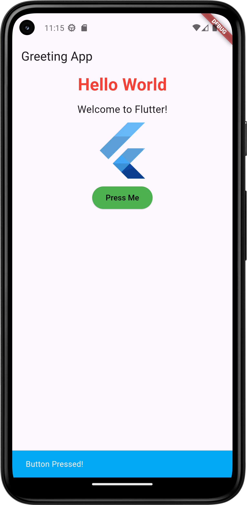

# Greeting App

Welcome to the Greeting App! This app is built using Flutter and is designed to send personalized greetings. 

## Features

- Greet Users.
- Beautiful user interface.
- Easy to use.

## Screenshots




## Getting Started

To get started with the app, follow these steps:

1. **Clone the repository:**
    ```bash
    git clone https://github.com/your-username/greeting-app.git
    ```
2. **Navigate to the project directory:**
    ```bash
    cd greeting-app
    ```
3. **Install dependencies:**
    ```bash
    flutter pub get
    ```
4. **Run the app:**
    ```bash
    flutter run
    ```

## Built With

- [Flutter](https://flutter.dev/) - The framework used

