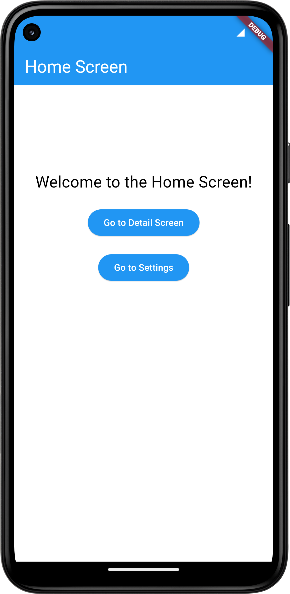
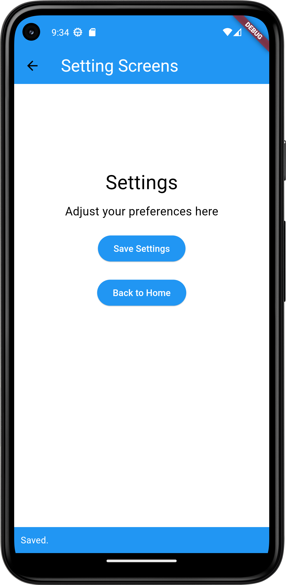

# Ostad Assignment 2

This project demonstrates a simple Flutter application with three screens: Home, Settings, and Detail. The corresponding screenshots can be found in the `ss` directory.

## Screenshots

1. **Home Screen**
   
   

2. **Settings Screen**

   

3. **Detail Screen**

   

## Getting Started

To run this project locally, follow these steps:

1. **Clone the repository:**
   \`\`\`sh
   git clone <repository_url>
   \`\`\`

2. **Navigate to the project directory:**
   \`\`\`sh
   cd <project_directory>
   \`\`\`

3. **Install dependencies:**
   \`\`\`sh
   flutter pub get
   \`\`\`

4. **Run the application:**
   \`\`\`sh
   flutter run
   \`\`\`

## Project Structure

\`\`\`
.
├── lib
│   ├── main.dart
│   ├── home_screen.dart
│   ├── settings_screen.dart
│   └── detail_screen.dart
├── ss
│   ├── 1.png
│   ├── 2.png
│   └── 3.png
└── README.md
\`\`\`

## Dependencies

This project uses the following dependencies:

- Flutter SDK
- Other relevant dependencies...

## Features

- **Home Screen:** The main screen of the application.
- **Settings Screen:** A screen to adjust settings.
- **Detail Screen:** A screen to view detailed information.

## Author

- B.M.Shadman Sakib Mahee

## License

This project is licensed under the MIT License - see the [LICENSE](LICENSE) file for details.
