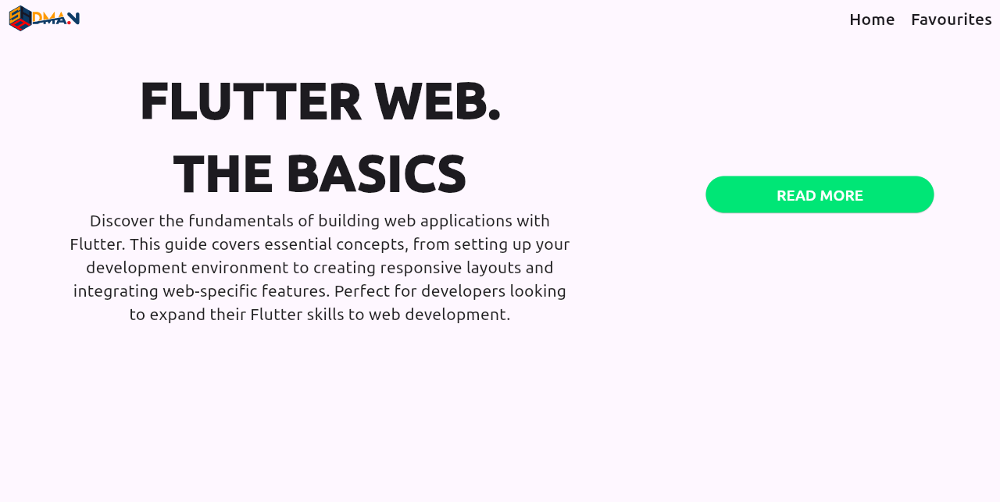
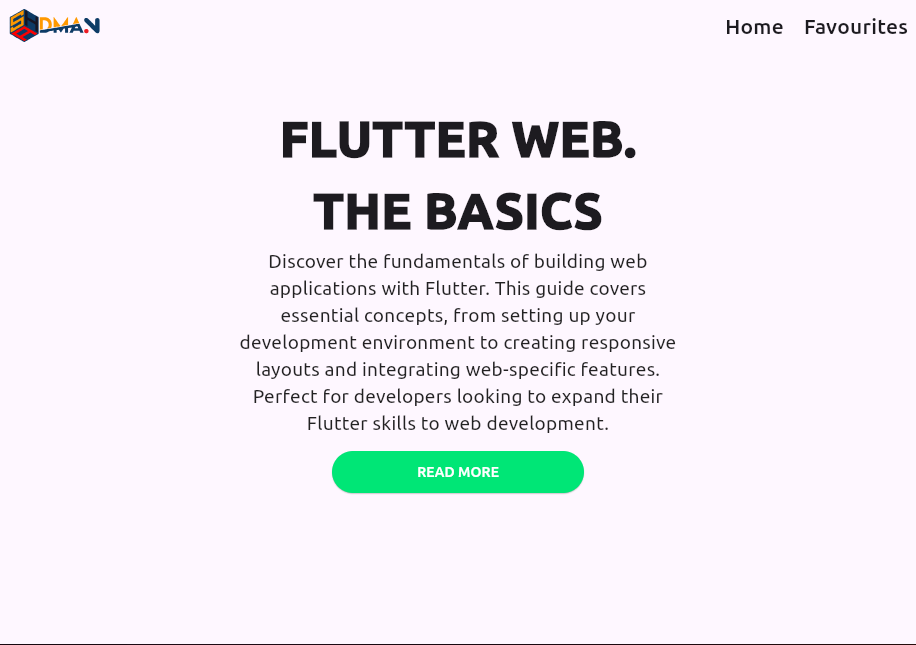
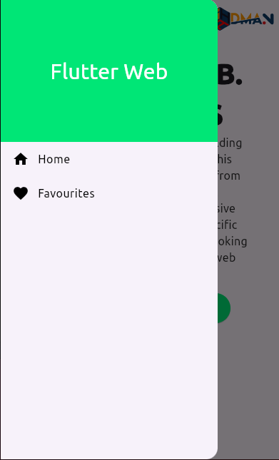
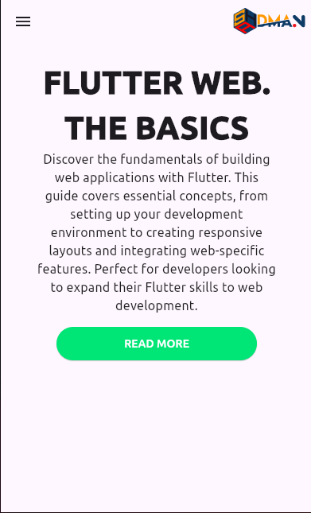

# Assignment 3: Responsive Flutter Practice

## Project Overview

This project is designed to practice creating responsive Flutter applications that adapt to different screen sizes, including Desktop, Tablet, and Mobile views. 

## Screenshots

### Desktop View

### Tablet View

### Mobile View (Layout 1)

### Mobile View (Layout 2)

## Download the SS Directory

To download the `SS` directory with all the screenshots:

1. Click [here](#) to download as a ZIP file.

Alternatively, you can download individual files by clicking the links below:
- [1.png](#)
- [2.png](#)
- [3.png](#)
- [4.png](#)

---

**Note**: Replace the `#` in the links with the actual URLs to the files or the download link after you upload the files to a hosting service or repository.
