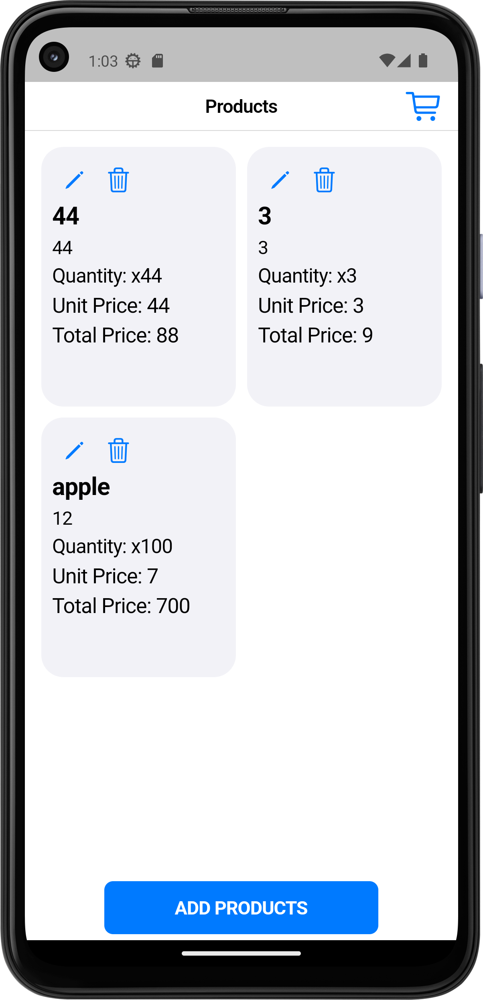
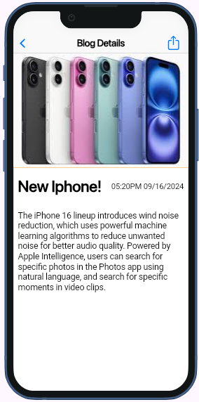
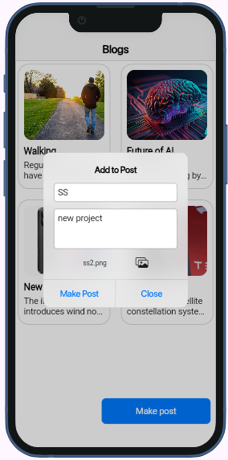
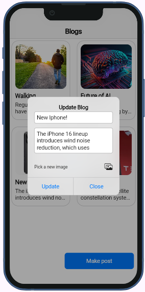
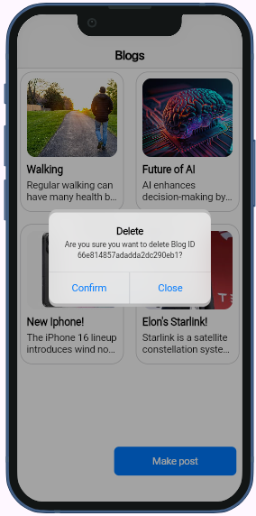

# Blog App

This is a Flutter-based **Cupertino App** named **Blog**. The app provides a user-friendly interface for managing blog posts, including operations for Create, Read, Update, and Delete.

## Features
- **Create** a blog post (Screenshot: s3.png)
- **Read** existing blog posts (Screenshots: s1.png, s2.png)
- **Update** a blog post (Screenshot: s5.png)
- **Delete** a blog post (Screenshot: s6.png)

## Screenshots

### Read Operation
| Screenshot 1 | Screenshot 2 |
| ------------ | ------------ |
|  |  |

### Create Operation
| Screenshot 3 |
| ------------ |
|  |

### Update Operation
| Screenshot 5 |
| ------------ |
|  |

### Delete Operation
| Screenshot 6 |
| ------------ |
|  |