# Task Manager App

The Task Manager App is a productivity tool that helps you organize, manage, and track tasks efficiently. Built with Flutter and powered by an API from the Ostad Team, the app is designed for ease of use, featuring stateful widgets to manage task statuses with a simple and intuitive UI.

---

## ✨ Features

- **User Registration & Login**: Register or log in to securely access your tasks.
- **Password Recovery**: Reset your password with email and OTP verification.
- **Profile Management**: Easily update your profile details.
- **Task Management**: Create, view, and track tasks across different statuses.
- **Real-Time Status Updates**: Update tasks to "New," "Completed," "Canceled," or "In-Progress."

---

## 📸 Screenshots

Here are previews of the key screens in the app, displayed side by side for easy viewing. Click any image to view in full size.

  <table>
    <tr>
      <td>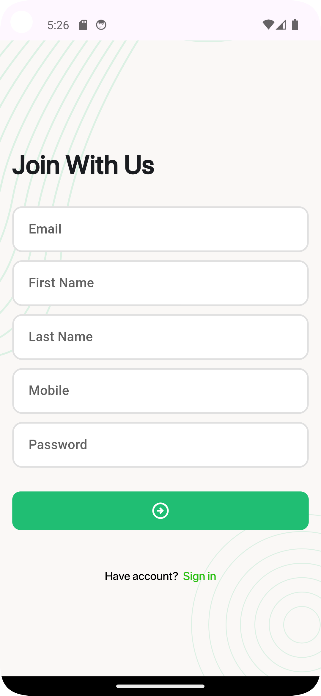 <b>Registration Screen</b></td>
      <td>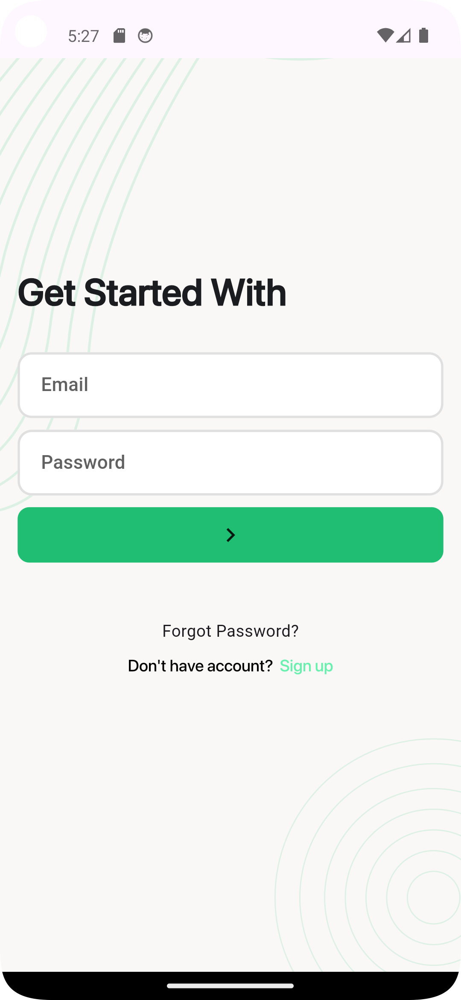 <b>Login Screen</b></td>
      <td>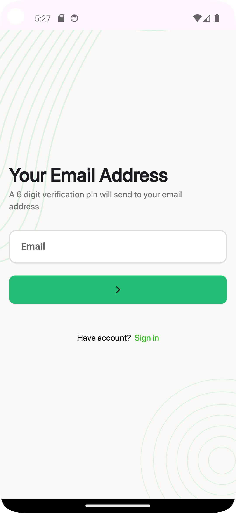 <b>Email Verification</b> (Password Recovery)</td>
    </tr>
    <tr>
      <td>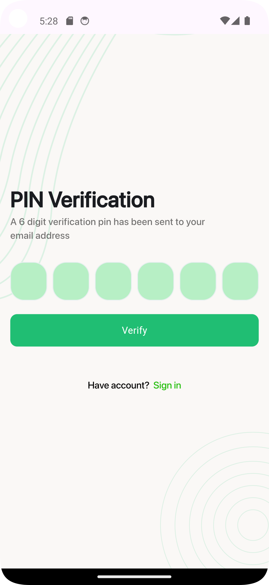 <b>OTP Verification</b> (Password Recovery)</td>
      <td>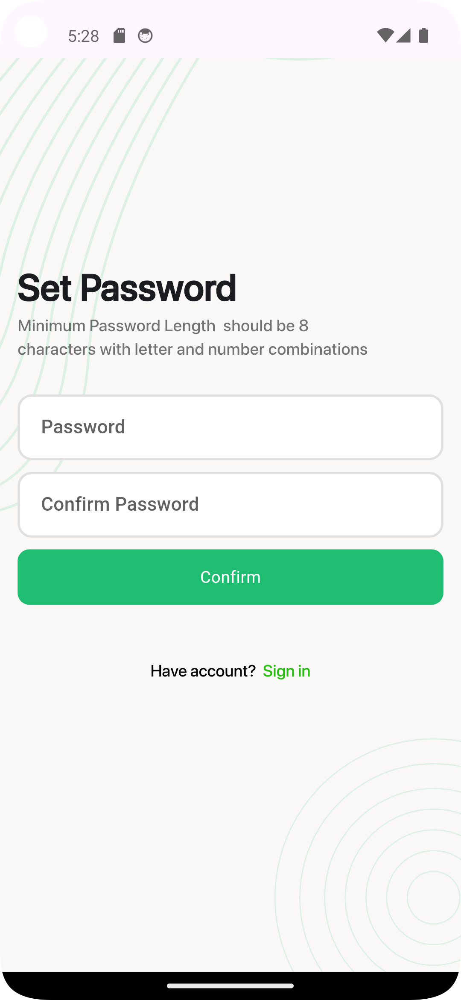 <b>New Password</b> (Password Recovery)</td>
      <td>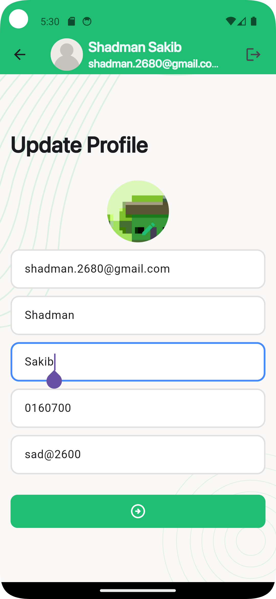 <b>Profile Update Screen</b></td>
    </tr>
    <tr>
      <td>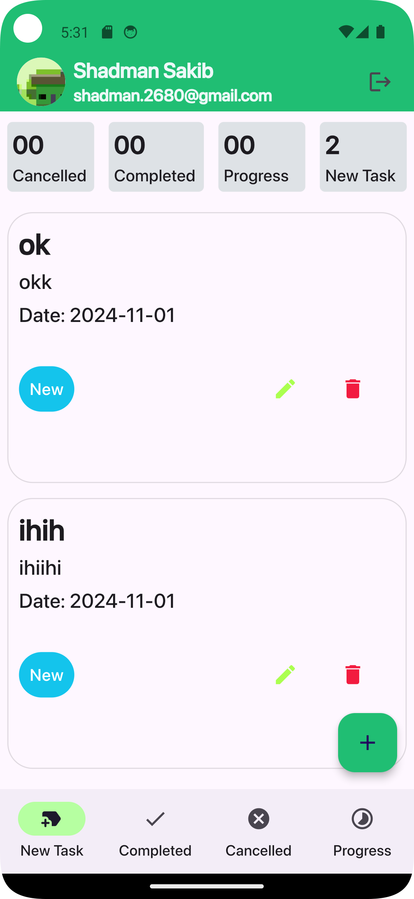 <b>Home + New Tasks Screen</b></td>
      <td>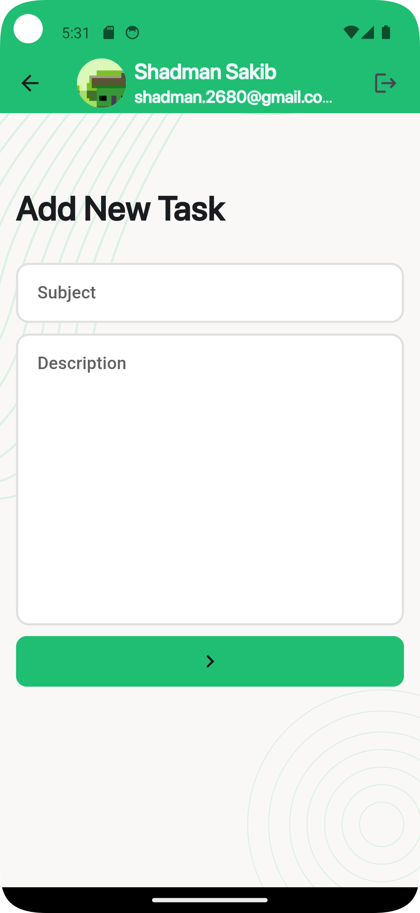 <b>Add New Task Screen</b></td>
      <td>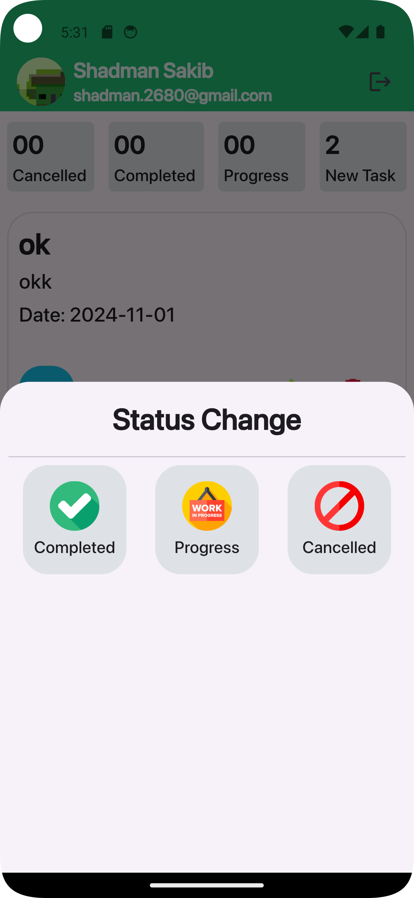 <b>Change Task Status Screen</b></td>
    </tr>
    <tr>
      <td>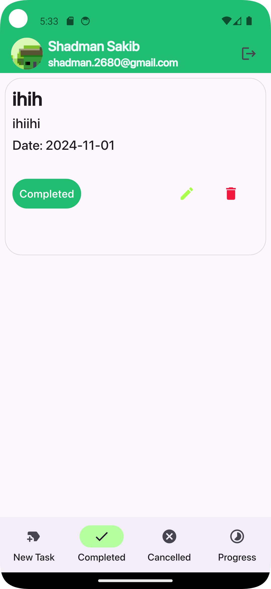 <b>Completed Tasks Screen</b></td>
      <td>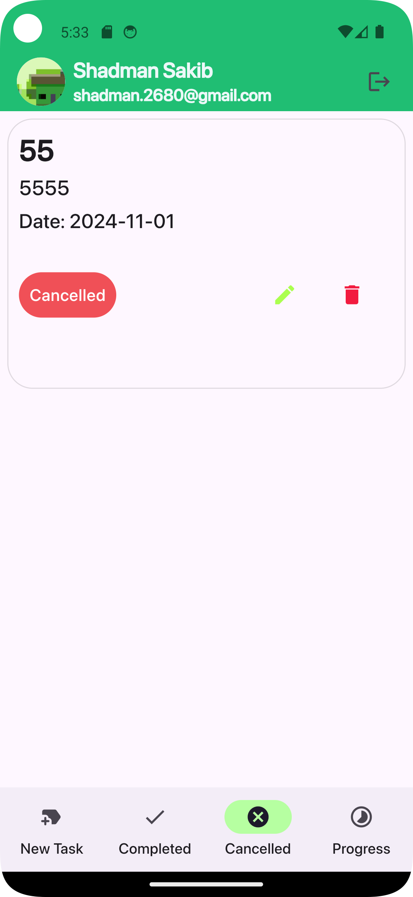 <b>Canceled Tasks Screen</b></td>
      <td>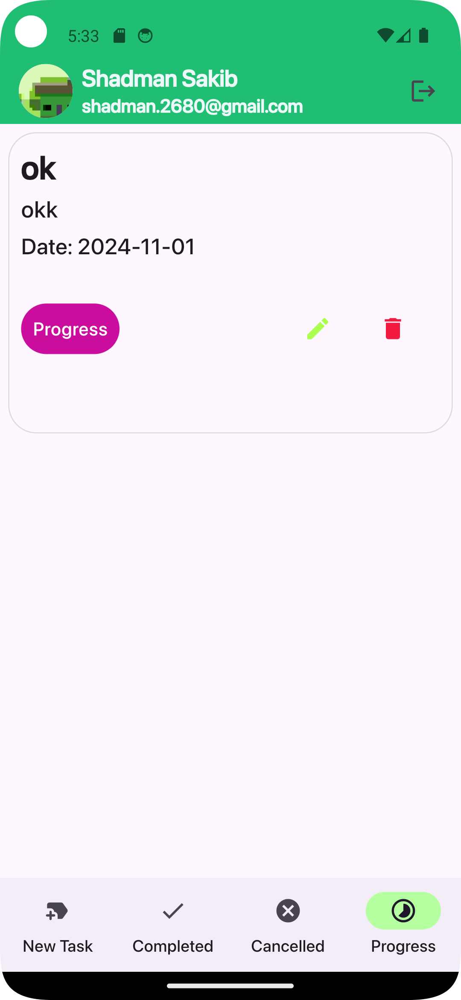 <b>In-Progress Tasks Screen</b></td>
    </tr>
  </table>

---