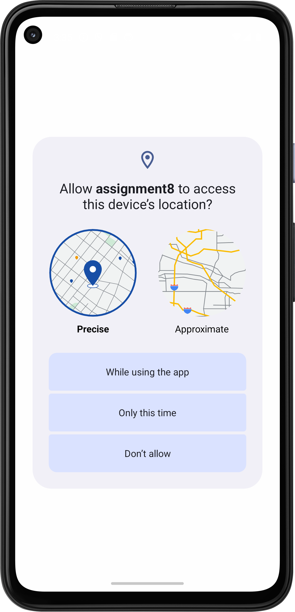
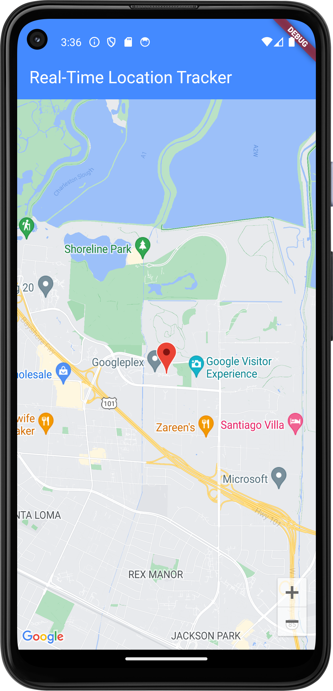

# Real-Time Location Tracker

Real-Time Location Tracker is an app that allows you to track the live location of users or assets seamlessly. It is designed to provide accurate location data in real-time, ensuring reliability and ease of use.

---

## Features

- **Live Location Tracking:** Monitor the real-time location of users or devices.
- **User-Friendly Interface:** Simplified UI for better user experience.
- **Multi-Platform Support:** Works on Android, iOS, and web platforms.
- **Customizable Settings:** Adjust settings to suit your needs.

---

## Screenshots

  
  

